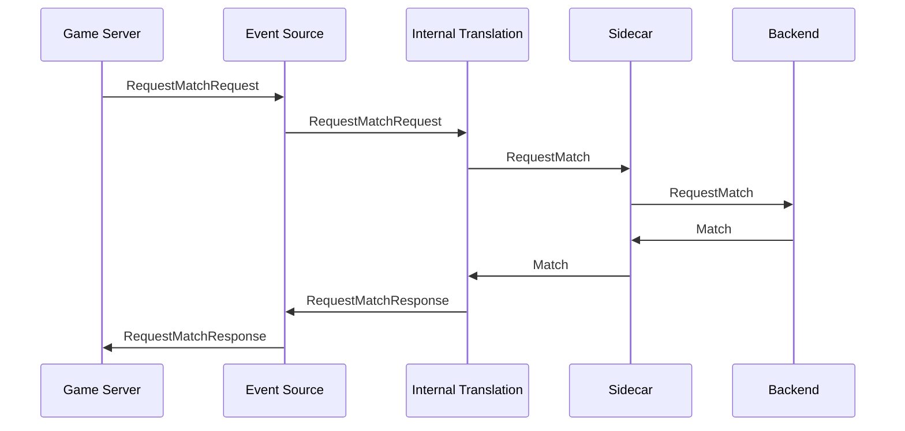

# EventSource

An event source provides a translation layer between your <tooltip term="game server">game server</tooltip>, the <tooltip term="backend platform">backend platform.</tooltip> and <tooltip term="fleet manager">fleet manager</tooltip>.
This way your game only needs to interface with the sidecar, and it can be deployed anywhere.

Currently, Catena supports the following event sources:

<snippet id="event-source-list">
<ul>
<li>Catena API Event Source - An event source which matches the <a href="Server-Manager.md">Catena Server Manager</a> API.</li>
<li>Virtual Server Event Source - A mock server for simulating calls or doing zero-code implementations</li>
</ul>
</snippet>

<chapter title="Why use a Virtual Server?" collapsible="true">
<p>
A virtual server can be used instead of implementing a backend server api on your game server for development. 

The sidecar will pretend to be your server, and follow a match management strategy as defined by the `strategy` in the configuration.

`continuous_strategy` for example will repeatedly request a match, and if one is returned, report that match as ready. If you run a game server next to this sidecar, the effect will be 
a continuous stream of new matches being sent to that server.
</p>

</chapter>

## Configuration

Below is an example configuration for an event source in the sidecar.

```json lines
{
  "app": {
      "event_source": {
        "use": "catena_api_event_source",
        "configs": {
          "catena_api_event_source": {
            "GrpcListenAddr": ":8080",
            "HttpListenAddr": ":8085"
          },
          "virtual_server_event_source": {
            "strategy": "continuous_strategy",
            "continuous_strategy": {
              "RequestInterval": "5s"
            }
          }
        }
      },
    }
}
```

`use` - The event source to use to ingest events into the sidecar, must match one of the configurations specified in `configs`.

`configs` - The configurations for the event sources.

[//]: # () TODO This will eventually be modified to support multiple event sources. These docs need to be updated when that changes

## Catena API Event Source

This event source will make calls to the backend on behalf of the sidecar. In practice that means a game server can make http or grpc requests to the sidecar, and it will augment those requests with necessary data and pass them to the
backend for you.

An example of how this works is shown below:




### Catena API Event Source Endpoints

<include from="MatchBroker-Snippets-Library.md" element-id="request-match-request"></include>

For `RequestMatch`, we will also register the server with the sidecar. If no ServerID is specified, one will be generated.

<include from="MatchBroker-Snippets-Library.md" element-id="match-ready-request"></include>

`MatchReady` can be sent with no Match ID. If it is omitted, the sidecar will assume one match per server and handle it automatically.

<include from="MatchBroker-Snippets-Library.md" element-id="end-match-request"></include>

`MatchEnd` can be sent with no Match ID, the sidecar will manage it manually.

### Config Fields

`GrpcListenAddr` - The address to listen on for grpc connections

`HttpListenAddr` - The address to listen on for http connections

## Virtual Server Event Source

The Virtual Server event source is ideal for cases where you want to test allocations without a game server, or you don't want to 
implement any API for the sidecar.

It will generate events based on the config.

### Config

`strategy` - The strategy to use to schedule match requests

#### Continuous Strategy

Continuously requests new matches, readies them up, and then ends them.

`RequestInterval` - The interval at which to request new matches