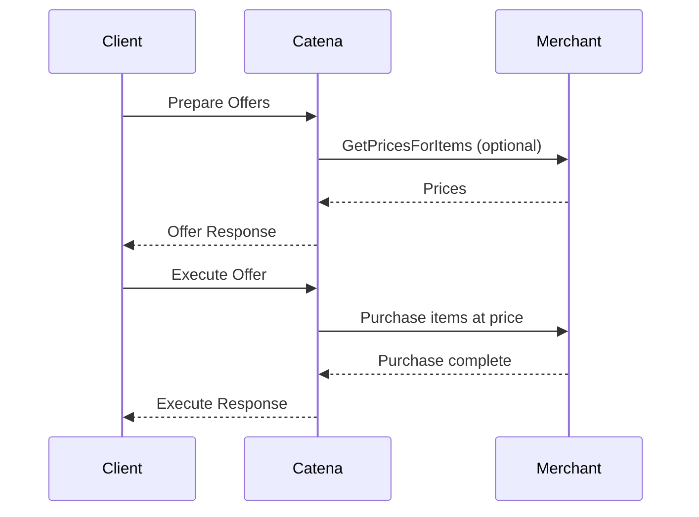

# Offers

During purchasing of items online, prices can change for many reasons: Sales and promotions can end, pricing can be modified, or a third party may change pricing. 

In any case, these changes present a condition in which the price that a user sees when they start a purchase is not the one that is actually in the Catena Backend or third party store. 

This means the price that a user sees on the checkout  page could be different from the one in game. Left unchecked this could result in a user being mildly frustrated in the mild case, or angry in the worst case.

_Offers_ are Catena's solution to this problem, they guarantee that a user's transaction will always occur with the price they expect and that there are no surprises through a two-step order flow. When a user
goes ot purchase an item, a trusted service _prepares_ a list of prices, the service then decides on behalf of the user what offers to _execute_. The backend will validate for you that none of the information
has changed, eliminating this race condition.

## Offer and Execute Flow

The offer and execute flow is a two-step process which generally involves Catena, a Trusted Service acting on behalf of a player, and a Marketplace/Merchant who is responsible for processing the transaction.



Note this flow works differently depending on your `OrderProvider` selection. For example, Steam DOES NOT request prices from Steam as the steam store does not store this information.

## An Example

Let's pretend we have a game like _Fortnite._ Players can purchase skins, emotes and more, but must first purchase in-game currency to do so. The purchase of this currency may occasionally have promotional pricing, or different
pricing for different currencies.

In our game we want to present the user with a UX to select the package(s) they want to buy, and then execute the transaction with a third party provider for this case, we will pretend it's steam.

[//]: # (https://excalidraw.com/#json=0gHBk9smoJZ2Bltd5dRiR,9GWMjLcD35dhmAXIoFwybg)


Note in this case, 1000 Gems have a promotional price of $250.00.

To build this UX, the backend will make a call to _PrepareOffersForProvider._ That request will look something like the following:

```HTTP
POST /api/v1/entitlements/offer/ENTITLEMENT_PROVIDER_STEAM/prepare HTTP/1.1
Host: localhost:5000
catena-session-id: {session-id-goes-here}
Content-Type: application/json
Content-Length: 132

{
    "account_id": "{account-id-goes-here}",
    "currency": "USD",
    "tag_filter": [
        "GEMS"
    ]
}
```

The server will then respond with a list of prices for the items matching the tag, along with offer ids:

```json
{
  "items": [
    {
      "offerId": "offer-a5872085-94e5-46ea-b3b9-80029b0ea1c2",
      "itemId": "item-cbf0b62a-762d-492a-8612-5718efa86c13",
      "currency": "USD",
      "description": "Gems to Purchase Items With",
      "priceDetails": [
        {
          "quantity": 10,
          "amount": 1
        }
      ]
    },
    {
      "offerId": "offer-17930abe-bdd2-4fec-8485-2961afcf0a7b",
      "itemId": "item-6b9158c7-93b2-4e0d-b9bf-11f5e7f53eaf",
      "currency": "USD",
      "description": "Entitles the player to 100 Gems",
      "priceDetails": [
        {
          "quantity": 50,
          "amount": 1
        }
      ]
    },
    {
      "offerId": "offer-3cc15ecd-a5a0-4260-b951-b539948388e0",
      "itemId": "item-62283139-834b-44dc-ae87-4cb2a96b6704",
      "currency": "USD",
      "description": "Entitles the player to 1000 Gems",
      "priceDetails": [
        {
          "quantity": 250,
          "amount": 1
        }
      ]
    }
  ]
}
```

It is up to the game how to present these, however the offer id should be associated with the cards displayed to the user.

When the user makes their selection, the Trusted Service can then execute the transaction using any number of the offers presented, for example, to purchase 1000 gems, the request would be: 

```HTTP
POST /api/v1/entitlements/offer/execute HTTP/1.1
Host: localhost:5000
catena-session-id: {session-id-goes-here}
Content-Type: application/json
Content-Length: 275

{
    "account_id": "{account-id-goes-here}",
    "prepared_orders": [
        {
            "prepared_order": "offer-3cc15ecd-a5a0-4260-b951-b539948388e0",
            "quantity": "1"
        }
    ],
    
    "provider": "ENTITLEMENT_PROVIDER_STEAM"
}
```

If all is successful, the backend replies with something resembling the following, which the user must then use to complete the transaction:

```json
{
    "success": true,
    "order_id": "123456789",
    "provider_result_details": {
        "steam": {
            "checkout_url": "https://store.steampowered.com/checkout/123456789"
        }
    }
}
```

In the case of the steam order provider, a user then needs to follow that checkout link and authorize the transaction, however the price shown on that Checkout page is now guarenteed to be the same as the one they were displayed in store.

If the prices have changed, the execute request will throw an InvalidPrecondition rpc exception with a message "Pricing data changed between preparing and executing the order."