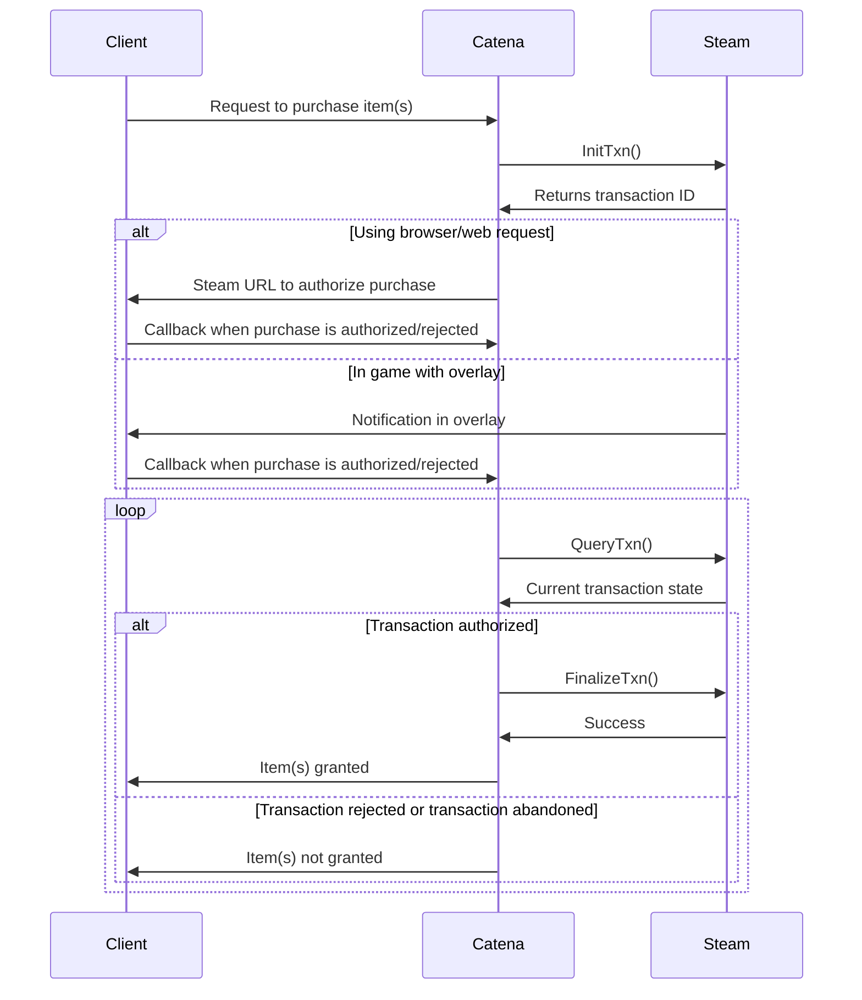
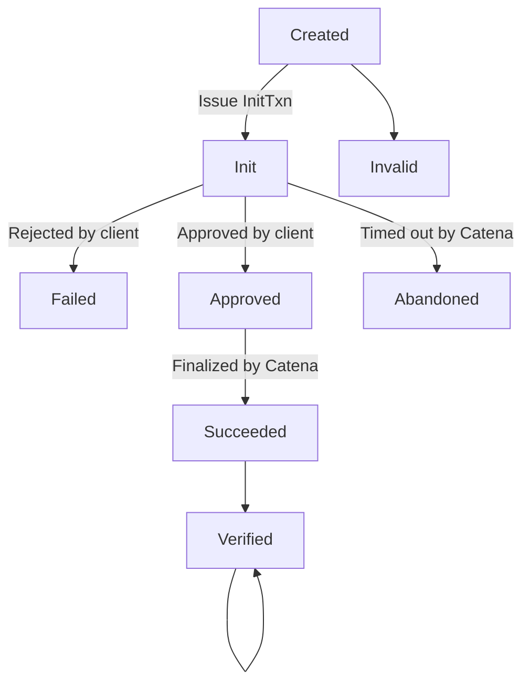

# Steam payments (Microtransactions)

## Call flow (browser client)

## Steam order/transaction status

`Created` is the state used by Catena to record/journal that a transaction is about to take place Catena; it is not a state in Steam.

`Abandoned` is a state reached by Catena when a transaction has not been approved/rejected by a deadline; it is not a state in Steam.

`Invalid` is a state reached by Catena when a transaction is recorded but an order ID collision prevents it from being started; it is not a state in Steam.

`Verified` is a state reached by Catena after a transaction has succeeded, each time it is verified.

`Reversed` is a state reached by Catena after a transaction when a transaction has been refunded/charged back.